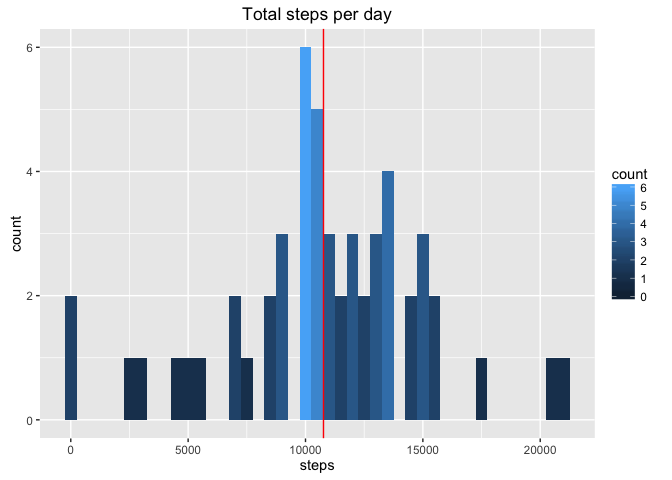
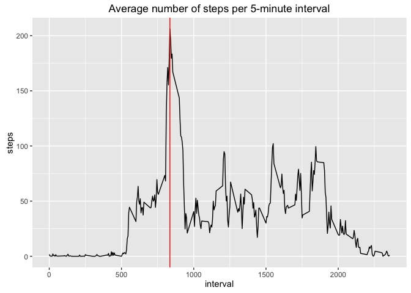
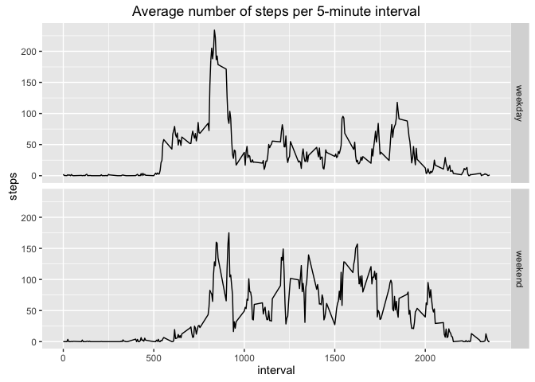

# Reproducible Research: Peer Assessment 1


## Loading and preprocessing the data

Loading the data and convert to date:

```r
pa1_loaded <- read.csv("activity.csv")
pa1_loaded$date <- as.Date(pa1_loaded$date, "%Y-%m-%d")
```

## What is mean total number of steps taken per day?

Using the library **ggplot**:

```r
library(ggplot2)
```

Total number of steps taken per day

```r
total_steps <- aggregate(steps ~ date, data = pa1_loaded, FUN = sum, is.na = F)
```

Plot histogram

```r
g <- ggplot(data = total_steps, aes(x = steps))
g <- g + geom_histogram(binwidth = 500, aes(fill=..count..))
g <- g + geom_vline(aes(xintercept = mean(steps)), color = "red")
g <- g + ggtitle("Total steps per day")
print(g)
```

<!-- -->

Calculating the mean and median of the total number of steps taken per day

```r
mean_steps <- mean(total_steps$steps)
mean_steps
```

```
## [1] 10766.19
```

```r
median_steps <- median(total_steps$steps)
median_steps
```

```
## [1] 10765
```

## What is the average daily activity pattern?

Calculating the average number of steps taken, averaged across all days:

```r
average_steps <- aggregate(steps ~ interval, data = pa1_loaded, FUN = mean, is.na = F)
```

Calculating and plot 5-minute interval, on average across all the days in the dataset, contains the maximum number of steps:

```r
interval_maxsteps = average_steps[average_steps$steps == max(average_steps$steps), ]$interval
```

This interval: 835

Series plot of the 5-minute interval (x-axis) and the average number of steps taken, averaged across all days (y-axis):

```r
g <- ggplot(data = average_steps, aes(x = interval, y = steps))
g <- g + geom_line()
g <- g + geom_vline(aes(xintercept = interval_maxsteps), color = "red")
g <- g + ggtitle("Average number of steps per 5-minute interval")
print(g)
```

<!-- -->

## Imputing missing values

The total number of missing values in the dataset:

```r
pa1_na <- is.na(pa1_loaded$steps)
sum(pa1_na)
```

```
## [1] 2304
```

Creating a new dataset that is equal to the original dataset but with the missing data filled in. We using the mean for that 5-minute interval:

```r
pa1_filled = pa1_loaded
pa1_filled$steps_filled <- pa1_filled$steps
for (index in 1:nrow(pa1_filled)) {
    if (is.na(pa1_filled[index, "steps_filled"])) {
        pa1_filled[index, "steps_filled"] <- average_steps[average_steps$interval == pa1_filled[index, "interval"], ]$steps
    }
}
```

Total number of steps taken per day

```r
total_steps_filled <- aggregate(steps_filled ~ date, data = pa1_filled, FUN = sum)
```

Plot histogram

```r
g <- ggplot(data = total_steps_filled, aes(x = steps_filled))
g <- g + geom_histogram(binwidth = 500, aes(fill=..count..))
g <- g + geom_vline(aes(xintercept = mean(steps_filled)), color = "red")
g <- g + ggtitle("Total steps per day")
print(g)
```

<!-- -->

Calculating the mean and median of the total number of steps taken per day:

```r
mean_steps_filled <- mean(total_steps_filled$steps_filled)
mean_steps_filled
```

```
## [1] 10766.19
```

```r
median_steps_filled <- median(total_steps_filled$steps_filled)
median_steps_filled
```

```
## [1] 10766.19
```

What is the impact of imputing missing data on the estimates of the total daily number of steps (in percent)?

```r
(mean_steps_filled - mean_steps) / mean_steps * 100
```

```
## [1] 0
```

```r
(median_steps_filled - median_steps) / median_steps * 100
```

```
## [1] 0.01104207
```

## Are there differences in activity patterns between weekdays and weekends?

Creating a new factor variable in the dataset with two levels -- "weekday" and "weekend" indicating whether a given date is a weekday or weekend day:

```r
pa1_filled$daytype <- 0
for (index in 1:nrow(pa1_filled)) {
    wd <- tolower(weekdays(pa1_filled[index, "date"], abbreviate = T))
    if (wd == "sa" || wd == "su" || wd == "сб" || wd == "вс") {
        pa1_filled[index, "daytype"] <- 1
    }
}
pa1_filled$daytype <- factor(pa1_filled$daytype, labels = c("weekday", "weekend"))
```

Series plot of the 5-minute interval (x-axis) and the average number of steps taken, averaged across all days (y-axis) for weekday / weekend:

```r
average_steps <- aggregate(steps ~ interval * daytype, data = pa1_filled, FUN = mean)

g <- ggplot(data = average_steps, aes(x = interval, y = steps))
g <- g + geom_line()
g <- g + facet_grid(daytype ~ .)
g <- g + ggtitle("Average number of steps per 5-minute interval")
print(g)
```

<!-- -->

